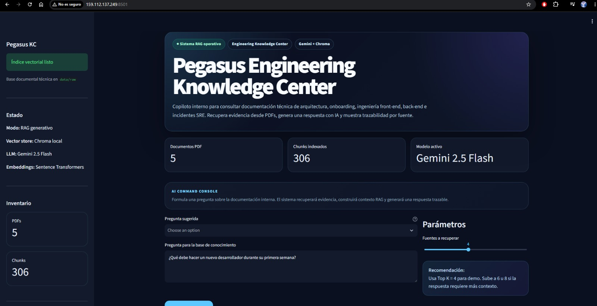
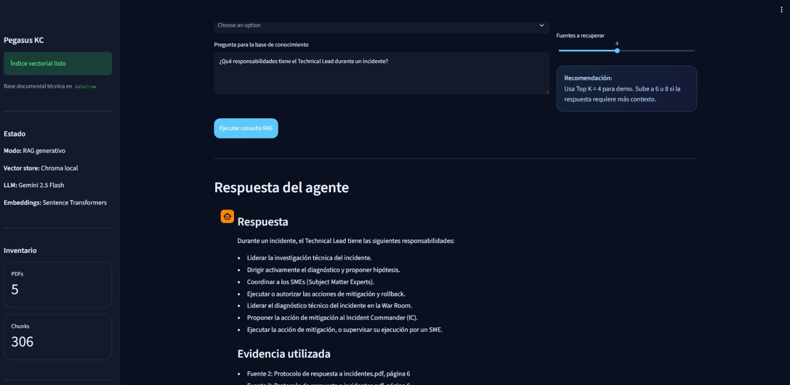
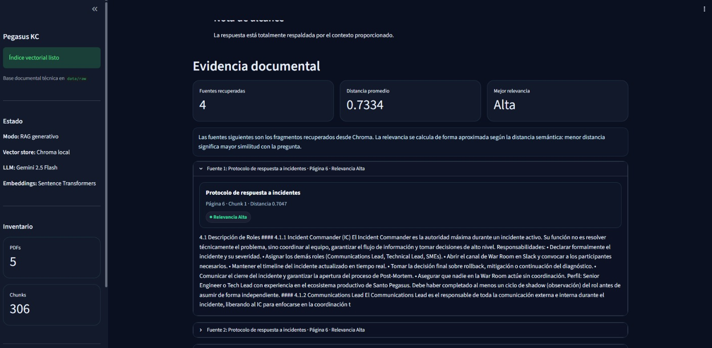
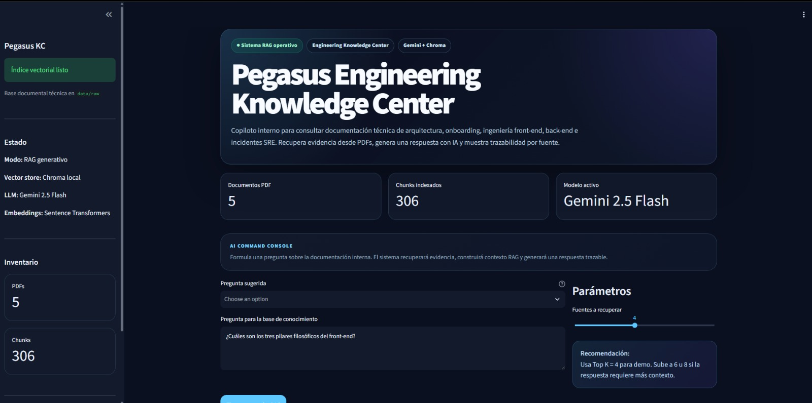
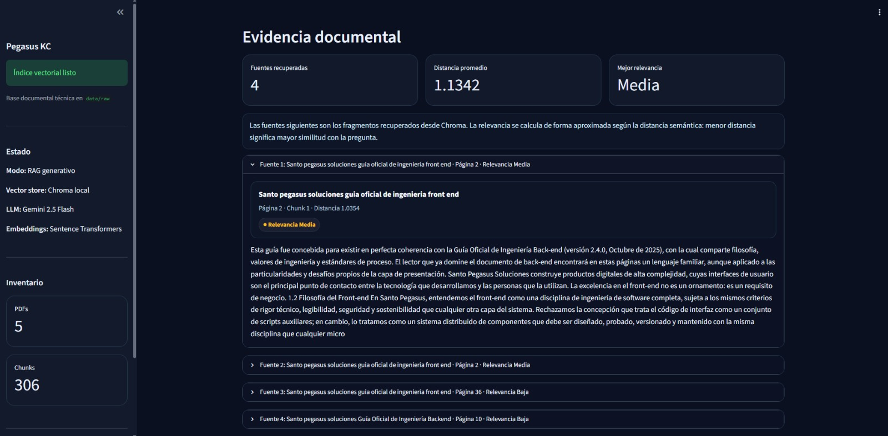
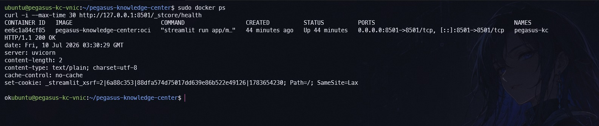
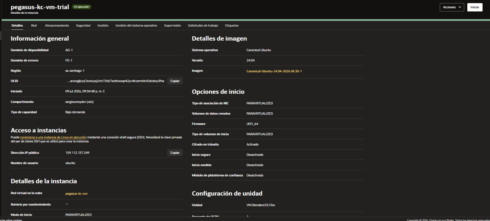

# Pegasus Engineering Knowledge Center

Agente RAG para consultar documentación técnica interna utilizando **Python**, **Streamlit**, **ChromaDB**, **Sentence Transformers**, **Gemini**, **Docker** y **Oracle Cloud Infrastructure**.

El proyecto fue desarrollado como Challenge Final **Alura Agente** y representa una solución empresarial para que equipos de ingeniería, SRE y DevOps puedan consultar documentación interna en lenguaje natural y recibir respuestas trazables, respaldadas por documentos, páginas y fragmentos específicos.

---

## Estado del proyecto

| Componente | Estado |
|---|---|
| Lectura y procesamiento de PDF | Completado |
| Chunking documental | Completado |
| Embeddings locales | Completado |
| Índice vectorial ChromaDB | Completado |
| Recuperación semántica | Completado |
| Generación con Gemini | Completado |
| Interfaz Streamlit | Completado |
| Ejecución mediante Docker | Completado |
| Repositorio público en GitHub | Completado |
| Deploy en OCI Compute | Completado |
| Evidencia visual del despliegue | Completado |

---

## Demostración pública

La aplicación se encuentra desplegada temporalmente en Oracle Cloud Infrastructure:

```text
http://159.112.137.249:8501
```

> La instancia OCI se mantiene activa para fines de demostración y evaluación. La dirección puede dejar de estar disponible después de finalizar el proceso de revisión, con el objetivo de evitar consumo innecesario de recursos promocionales.

---

## Vista general

**Pegasus Engineering Knowledge Center** es un copiloto interno de documentación técnica construido sobre el corpus **Santos Pegasus Soluciones**, material sugerido por Alura para el Challenge Final **Alura Agente**.

El corpus representa una empresa tecnológica ficticia especializada en:

- desarrollo de software escalable;
- arquitectura de microservicios;
- inteligencia artificial;
- ingeniería back-end;
- ingeniería front-end;
- onboarding técnico;
- prácticas SRE;
- respuesta a incidentes;
- post-mortems;
- seguridad en infraestructura;
- observabilidad y operación en la nube.

El sistema recibe una pregunta en lenguaje natural, localiza los fragmentos documentales más relevantes y construye una respuesta mediante Gemini, manteniendo trazabilidad hacia las fuentes utilizadas.

---

## Problema que resuelve

En organizaciones tecnológicas, la información interna suele distribuirse entre manuales, guías de arquitectura, protocolos de incidentes y documentos operativos extensos.

Esto provoca problemas como:

- tiempo perdido buscando respuestas manualmente;
- dependencia de personas con conocimiento histórico;
- incorporación lenta de nuevos desarrolladores;
- interpretación inconsistente de procedimientos;
- dificultad para encontrar evidencia durante incidentes;
- conocimiento fragmentado entre distintos documentos.

Pegasus Engineering Knowledge Center centraliza esa documentación y permite consultarla mediante preguntas como:

```text
¿Qué debe hacer un nuevo desarrollador durante su primera semana?
```

```text
¿Qué responsabilidades tiene el Technical Lead durante un incidente?
```

```text
¿Cuáles son los tres pilares filosóficos del front-end?
```

```text
¿Qué significa aplicar privilegio mínimo en microservicios?
```

```text
¿Qué debe incluir un post-mortem?
```

La respuesta no se limita a generar texto: también muestra los documentos, páginas, chunks y distancias semánticas que respaldan el resultado.

---

## Funcionalidades principales

- Lectura automatizada de documentos PDF.
- Extracción de texto conservando metadatos de página.
- Limpieza y normalización de contenido.
- División documental en chunks.
- Generación local de embeddings.
- Persistencia del índice vectorial con ChromaDB.
- Recuperación semántica configurable mediante Top K.
- Construcción de contexto RAG.
- Generación de respuestas con Gemini.
- Visualización de fuentes documentales.
- Identificación de páginas y chunks utilizados.
- Indicadores de relevancia semántica.
- Preguntas sugeridas para demostración.
- Métricas de documentos y fragmentos indexados.
- Interfaz tipo Engineering Command Center.
- Modo oscuro profesional.
- Ejecución local o mediante Docker.
- Despliegue público en OCI Compute.
- Health check de Streamlit.
- Gestión segura de variables de entorno.

---

## Origen del corpus documental

Este proyecto utiliza el corpus **Santos Pegasus Soluciones**, proporcionado como material sugerido por Alura para el Challenge Final **Alura Agente**.

Santos Pegasus Soluciones representa una empresa ficticia de tecnología especializada en desarrollo de software, arquitectura distribuida, ingeniería, seguridad y operaciones.

> Los documentos se utilizan exclusivamente con fines educativos y demostrativos. No contienen información confidencial de una empresa real.

---

## Documentos utilizados

La base de conocimiento se construye a partir de cinco documentos PDF ubicados en:

```text
data/raw/
```

Documentos incluidos:

```text
Arquitectura de Microservicios y Mapa de Dominios.pdf
Manual de Onboarding para nuevos desarrolladores.pdf
Protocolo de respuesta a incidentes.pdf
Santo pegasus soluciones guia oficial de ingenieria front end.pdf
Santo pegasus soluciones Guía Oficial de Ingeniería Backend.pdf
```

Estos documentos cubren materias como:

- onboarding técnico;
- roles y responsabilidades;
- arquitectura de microservicios;
- diseño de dominios;
- estándares de front-end;
- estándares de back-end;
- seguridad;
- privilegio mínimo;
- observabilidad;
- respuesta a incidentes;
- mitigación y rollback;
- post-mortems.

---

## Métricas actuales

| Métrica | Valor |
|---|---:|
| Documentos PDF | 5 |
| Chunks indexados | 306 |
| Vector store | ChromaDB local |
| Modelo de embeddings | Sentence Transformers |
| Modelo generativo | Gemini 2.5 Flash |
| Interfaz | Streamlit |
| Puerto de aplicación | 8501 |

---

## Arquitectura RAG

```text
Documentos PDF
      ↓
Extracción de texto con pypdf
      ↓
Normalización del contenido
      ↓
División en chunks
      ↓
Embeddings con Sentence Transformers
      ↓
Índice vectorial persistente en ChromaDB
      ↓
Pregunta del usuario
      ↓
Búsqueda semántica Top K
      ↓
Selección de evidencia relevante
      ↓
Construcción del contexto RAG
      ↓
Generación de respuesta con Gemini
      ↓
Respuesta con fuentes, páginas y chunks
```

---

## Arquitectura del despliegue

```text
Usuario
   ↓ HTTP :8501
Dirección IPv4 pública de OCI
   ↓
Virtual Cloud Network
   ↓
Subred pública
   ↓
Regla de entrada TCP 8501
   ↓
Instancia OCI Compute
   ↓
Ubuntu 24.04
   ↓
Docker Engine
   ↓
Contenedor Pegasus Knowledge Center
   ↓
Streamlit + ChromaDB + Sentence Transformers
   ↓
API de Gemini
```

---

## Tecnologías utilizadas

| Área | Tecnología |
|---|---|
| Lenguaje principal | Python 3.12 |
| Interfaz web | Streamlit |
| Lectura de documentos | pypdf |
| Embeddings | Sentence Transformers |
| Base vectorial | ChromaDB |
| Modelo generativo | Gemini 2.5 Flash |
| Variables de entorno | python-dotenv |
| Contenedores | Docker Engine |
| Control de versiones | Git |
| Repositorio remoto | GitHub |
| Sistema operativo del servidor | Canonical Ubuntu 24.04 |
| Infraestructura | Oracle Cloud Infrastructure |
| Servicio de nube | OCI Compute |

---

## Estructura del proyecto

```text
pegasus-knowledge-center/
├── .streamlit/
│   └── config.toml
├── app/
│   ├── loaders/
│   │   ├── __init__.py
│   │   └── pdf_loader.py
│   ├── rag/
│   │   ├── __init__.py
│   │   ├── chunking.py
│   │   ├── embeddings.py
│   │   ├── llm.py
│   │   ├── pipeline.py
│   │   └── vector_store.py
│   ├── __init__.py
│   └── main.py
├── data/
│   └── raw/
├── docs/
│   ├── screenshots/
│   │   ├── 01-app-publica-oci.jpeg
│   │   ├── 02-1-respuesta-rag-fuentes.jpeg
│   │   ├── 02-2-respuesta-rag-fuentes.jpeg
│   │   ├── 02-3-respuesta-rag-fuentes.jpeg
│   │   ├── 02-4-respuesta-rag-fuentes.jpeg
│   │   ├── 03-docker-healthcheck.jpeg
│   │   └── 04-oci-instance-running.jpeg
│   └── test-questions.md
├── scripts/
│   ├── build_index.py
│   ├── check_chunks.py
│   ├── check_embeddings.py
│   ├── check_gemini.py
│   ├── check_pdfs.py
│   ├── check_rag_answer.py
│   ├── check_rag_context.py
│   └── check_search.py
├── .dockerignore
├── .env.example
├── .gitignore
├── Dockerfile
├── README.md
└── requirements.txt
```

---

## Requisitos

Para ejecutar el proyecto localmente:

- Python 3.12.
- Git.
- Una API key válida de Gemini.
- Docker Desktop, opcional para ejecución en contenedor.
- Al menos 6 GB de memoria recomendada para construir la imagen Docker.

---

## Variables de entorno

Copia el archivo de ejemplo:

```powershell
copy .env.example .env
```

Configura el archivo `.env`:

```env
APP_NAME=Pegasus Engineering Knowledge Center
APP_ENV=dev

DATA_DIR=./data/raw
VECTORSTORE_DIR=./vectorstore/chroma

LLM_PROVIDER=gemini
LLM_MODEL=gemini-2.5-flash
GEMINI_API_KEY=your_api_key_here
```

El archivo `.env` contiene secretos y no debe subirse a GitHub.

El repositorio incluye:

```text
.env.example
```

pero excluye:

```text
.env
```

mediante `.gitignore`.

---

## Ejecución local

### 1. Clonar el repositorio

```powershell
git clone https://github.com/SC-Sergio/pegasus-knowledge-center.git
cd pegasus-knowledge-center
```

### 2. Crear un entorno virtual

```powershell
python -m venv .venv
.\.venv\Scripts\Activate.ps1
```

### 3. Instalar dependencias

```powershell
python -m pip install --upgrade pip
pip install -r requirements.txt
```

### 4. Configurar variables de entorno

```powershell
copy .env.example .env
```

Edita `.env` y agrega tu API key de Gemini.

### 5. Construir el índice vectorial

```powershell
python scripts\build_index.py
```

Este proceso:

1. localiza los documentos en `data/raw`;
2. extrae el contenido de cada página;
3. genera los chunks;
4. calcula los embeddings;
5. crea el índice ChromaDB;
6. almacena el índice en `vectorstore/chroma`.

### 6. Ejecutar Streamlit

```powershell
streamlit run app\main.py
```

Abrir en el navegador:

```text
http://localhost:8501
```

---

## Ejecución con Docker

### 1. Construir la imagen

```powershell
docker build -t pegasus-knowledge-center:local .
```

El proceso instala las dependencias y construye el índice vectorial dentro de la imagen.

### 2. Ejecutar el contenedor

```powershell
docker run --rm `
  --name pegasus-kc `
  -p 8501:8501 `
  --env-file .env `
  pegasus-knowledge-center:local
```

Abrir:

```text
http://localhost:8501
```

### Puerto alternativo

Si el puerto `8501` está ocupado:

```powershell
docker run --rm `
  --name pegasus-kc `
  -p 8502:8501 `
  --env-file .env `
  pegasus-knowledge-center:local
```

Abrir:

```text
http://localhost:8502
```

---

## Scripts de validación

| Script | Propósito |
|---|---|
| `scripts/check_pdfs.py` | Verifica la lectura de los PDF |
| `scripts/check_chunks.py` | Verifica la generación de chunks |
| `scripts/check_embeddings.py` | Verifica los embeddings locales |
| `scripts/build_index.py` | Construye el índice ChromaDB |
| `scripts/check_search.py` | Prueba la búsqueda semántica |
| `scripts/check_rag_context.py` | Muestra el contexto RAG recuperado |
| `scripts/check_gemini.py` | Verifica la conexión con Gemini |
| `scripts/check_rag_answer.py` | Prueba el flujo RAG completo |

Ejemplo:

```powershell
python scripts\check_rag_answer.py
```

---

## Ejemplos de consultas

### Consulta 1

```text
¿Cuáles son los tres pilares filosóficos del front-end?
```

Respuesta esperada:

```text
Los tres pilares filosóficos que guían las decisiones de front-end son:

1. Experiencia del Usuario como Métrica Técnica.
2. Componentes como Contratos.
3. Seguridad en la Capa de Presentación.
```

Fuente principal:

```text
Santo pegasus soluciones guia oficial de ingenieria front end.pdf
Página 2
```

---

### Consulta 2

```text
¿Qué responsabilidades tiene el Technical Lead durante un incidente?
```

Respuesta esperada:

```text
El Technical Lead lidera la investigación técnica, dirige el diagnóstico,
propone hipótesis, coordina a los especialistas y ejecuta o autoriza
acciones de mitigación y rollback.
```

Fuente principal:

```text
Protocolo de respuesta a incidentes.pdf
Página 6
```

---

### Consulta 3

```text
¿Qué debe hacer un nuevo desarrollador durante su primera semana?
```

Respuesta esperada:

```text
Durante la primera semana, el nuevo desarrollador debe configurar su entorno,
conocer al equipo y avanzar en el onboarding técnico. No se espera que alcance
productividad plena al finalizar la primera semana.
```

Fuente principal:

```text
Manual de Onboarding para nuevos desarrolladores.pdf
Página 31
```

---

### Consulta 4

```text
¿Qué principios arquitectónicos guían los microservicios?
```

La respuesta se construye utilizando la evidencia recuperada desde el documento de arquitectura y muestra el alcance de la información disponible cuando el corpus no contiene una enumeración completa.

---

## Capturas de pantalla

### Aplicación pública desplegada en OCI

La interfaz se encuentra ejecutándose en una instancia de Oracle Cloud Infrastructure y es accesible mediante la dirección IPv4 pública de la VM.



---

### Evidencia de consultas RAG

Las siguientes capturas muestran respuestas generadas mediante Gemini a partir del contexto recuperado desde la base documental.

Cada resultado incluye:

- respuesta generativa;
- documento fuente;
- página;
- chunk;
- distancia semántica;
- nivel aproximado de relevancia;
- contexto enviado al modelo.

#### Consulta RAG 1



#### Consulta RAG 2



#### Consulta RAG 3



#### Consulta RAG 4



---

### Contenedor Docker y health check

La aplicación se ejecuta dentro de un contenedor Docker.

El endpoint de salud de Streamlit respondió correctamente con:

```text
HTTP/1.1 200 OK
```



---

### Instancia OCI Compute

La aplicación fue desplegada en una instancia OCI Compute ubicada en la región Chile Central, Santiago.



---

## Deploy en Oracle Cloud Infrastructure

**Estado del despliegue:** operativo.

**URL pública temporal:**

```text
http://159.112.137.249:8501
```

### Infraestructura utilizada

| Componente | Configuración |
|---|---|
| Plataforma | Oracle Cloud Infrastructure |
| Región | Chile Central, Santiago |
| Servicio | OCI Compute |
| Instancia | `pegasus-kc-vm-trial` |
| Sistema operativo | Canonical Ubuntu 24.04 |
| Unidad | VM.Standard.E5.Flex |
| Procesamiento | 1 OCPU |
| Memoria | 6 GB |
| Almacenamiento | Volumen de inicio OCI |
| Arquitectura | x86_64 |
| Contenedores | Docker Engine |
| Puerto público | TCP 8501 |
| Vector store | ChromaDB |
| Aplicación | Streamlit |
| Modelo generativo | Gemini 2.5 Flash |

### Red configurada

```text
VCN: pegasus-kc-vcn
Subred: subred pública-pegasus-kc-vcn
Dirección IPv4 pública: habilitada
Dirección IPv4 privada: asignada automáticamente
Regla de entrada: TCP 8501 desde 0.0.0.0/0
```

La lista de seguridad conserva también el puerto TCP `22` para la administración de la instancia mediante SSH.

### Preparación de la instancia

La conexión se realizó mediante SSH:

```powershell
ssh -i "$HOME\.ssh\oci_pegasus_kc_trial.key" ubuntu@159.112.137.249
```

Dentro de Ubuntu se configuraron:

- Docker Engine;
- Docker Compose;
- Git;
- certificados del sistema;
- 4 GB de memoria swap;
- inicio automático del servicio Docker.

### Construcción en OCI

```bash
git clone https://github.com/SC-Sergio/pegasus-knowledge-center.git
cd pegasus-knowledge-center

cp .env.example .env
chmod 600 .env

sudo docker build \
  --progress=plain \
  -t pegasus-knowledge-center:oci \
  .
```

### Ejecución del contenedor

```bash
sudo docker run -d \
  --name pegasus-kc \
  --restart unless-stopped \
  -p 8501:8501 \
  --env-file .env \
  pegasus-knowledge-center:oci
```

La política:

```text
unless-stopped
```

permite que el contenedor vuelva a iniciarse automáticamente cuando se reinicia Docker o la instancia, salvo que haya sido detenido manualmente.

### Verificación del contenedor

```bash
sudo docker ps
```

Resultado:

```text
Contenedor: pegasus-kc
Estado: Up
Puerto: 0.0.0.0:8501 -> 8501/tcp
```

### Verificación de logs

```bash
sudo docker logs --tail 100 pegasus-kc
```

Resultado principal:

```text
Uvicorn server started on 0.0.0.0:8501
You can now view your Streamlit app in your browser.
```

### Health check

```bash
curl -i \
  --max-time 30 \
  http://127.0.0.1:8501/_stcore/health
```

Resultado:

```text
HTTP/1.1 200 OK
```

### Verificación desde Windows

```powershell
Test-NetConnection 159.112.137.249 -Port 8501
```

Resultado:

```text
TcpTestSucceeded : True
```

---

## Gestión de secretos

La API key de Gemini no se encuentra almacenada en el repositorio.

La clave se configura únicamente en el servidor mediante:

```text
.env
```

El contenedor recibe las variables con:

```bash
--env-file .env
```

Controles aplicados:

- `.env` excluido mediante `.gitignore`;
- `.env.example` disponible como plantilla;
- permisos restringidos para `.env` en el servidor;
- claves SSH privadas almacenadas fuera del proyecto;
- secretos no incluidos en imágenes ni capturas;
- vectorstore regenerable mediante scripts.

---

## Seguridad

Buenas prácticas aplicadas:

- Variables sensibles fuera del control de versiones.
- Clave de Gemini inyectada en tiempo de ejecución.
- Uso de autenticación SSH mediante par de claves.
- Puerto SSH `22` conservado para administración remota.
- Puerto público limitado específicamente a TCP `8501`.
- No se exponen todos los puertos TCP.
- Regla de red stateful en OCI.
- Cifrado en tránsito del volumen de inicio activado.
- Archivo `.env` protegido en la instancia.
- Contenedor aislado del sistema operativo anfitrión.
- Presupuesto preventivo configurado en OCI.
- Instancia temporal para evitar consumo innecesario.

---

## Historial de desarrollo

El repositorio conserva commits incrementales que reflejan la evolución del proyecto:

```text
chore: initialize Streamlit project base
feat: add reusable PDF loading pipeline
feat: add document chunking pipeline
feat: add local embeddings generation
feat: add persistent Chroma vector store
feat: add RAG context assembly pipeline
feat: connect RAG retrieval to Streamlit interface
feat: add Gemini-powered RAG answers
docs: add RAG evaluation questions
refactor: improve Gemini RAG response prompt
style: refine Streamlit command center interface
style: add relevance badges to evidence cards
chore: add Docker container setup
docs: improve project README
docs: clarify Alura sample corpus usage
```

Este historial demuestra un desarrollo progresivo en lugar de una única carga final del código.

---

## Limitaciones actuales

- Solo procesa documentos PDF con texto extraíble.
- No implementa OCR para documentos escaneados.
- El índice vectorial debe reconstruirse cuando cambian los documentos.
- La relevancia se calcula mediante distancia semántica aproximada.
- La calidad de las respuestas depende de los chunks recuperados.
- La aplicación depende de conectividad externa para consultar Gemini.
- La demostración pública utiliza HTTP.
- No se ha configurado dominio personalizado.
- No se ha configurado un certificado TLS.
- La dirección IPv4 pública puede cambiar si la instancia se elimina y se crea nuevamente.
- La instancia OCI es temporal y puede desactivarse después de la evaluación.
- La imagen Docker actual incluye dependencias que podrían optimizarse para reducir su tamaño.

---

## Mejoras futuras

- Incorporar OCR para documentos escaneados.
- Permitir carga dinámica de documentos desde la interfaz.
- Reconstruir el índice automáticamente al detectar cambios.
- Agregar filtros por documento o categoría.
- Incorporar historial de conversaciones.
- Agregar autenticación para usuarios internos.
- Implementar roles y permisos.
- Agregar pruebas automatizadas del pipeline RAG.
- Incorporar métricas de precisión y evaluación.
- Optimizar la imagen Docker para CPU.
- Configurar proxy inverso con Nginx.
- Incorporar HTTPS y dominio personalizado.
- Añadir observabilidad y logs centralizados.
- Implementar un flujo de integración y despliegue continuo.

---

## Roadmap completado

- [x] Crear la aplicación base con Streamlit.
- [x] Leer documentos PDF.
- [x] Implementar un loader reutilizable.
- [x] Crear el pipeline de chunking.
- [x] Generar embeddings locales.
- [x] Persistir el índice en ChromaDB.
- [x] Implementar búsqueda semántica.
- [x] Construir el contexto RAG.
- [x] Integrar Gemini.
- [x] Mostrar fuentes y trazabilidad documental.
- [x] Crear una interfaz visual profesional.
- [x] Agregar badges de relevancia.
- [x] Incorporar preguntas sugeridas.
- [x] Incorporar scripts de validación.
- [x] Crear el Dockerfile.
- [x] Configurar `.dockerignore`.
- [x] Validar la imagen Docker localmente.
- [x] Publicar el código en GitHub.
- [x] Crear una VCN en OCI.
- [x] Crear una subred pública.
- [x] Crear una instancia OCI Compute.
- [x] Instalar Docker en Ubuntu.
- [x] Construir la imagen en OCI.
- [x] Ejecutar el contenedor en OCI.
- [x] Habilitar el puerto TCP 8501.
- [x] Verificar el health check HTTP 200.
- [x] Validar el acceso desde Internet.
- [x] Agregar capturas del despliegue.
- [x] Completar la documentación final.

---

## Criterios del Challenge Alura Agente

| Criterio | Evidencia |
|---|---|
| Procesamiento de PDF o CSV | Cinco documentos PDF procesados |
| Preguntas en lenguaje natural | Interfaz de consulta Streamlit |
| Respuestas basadas en documentos | Pipeline RAG con ChromaDB |
| Modelo de inteligencia artificial | Gemini 2.5 Flash |
| Fuentes y trazabilidad | Documento, página, chunk y distancia |
| Código publicado | Repositorio GitHub público |
| README completo | Instalación, arquitectura y deploy documentados |
| Historial de commits | Desarrollo incremental registrado |
| Aplicación dockerizada | Dockerfile y ejecución verificada |
| Deploy en Oracle Cloud | OCI Compute operativo |
| Evidencia del despliegue | Capturas incluidas en `docs/screenshots` |

---

## Autor

**Sergio Carey**

Ingeniero en Informática  
Arica, Chile

---

## Licencia y propósito

Proyecto desarrollado con fines educativos para el Challenge Final **Alura Agente**.

El corpus Santos Pegasus Soluciones representa una organización ficticia y se utiliza como material de demostración para construir un agente RAG funcional.

El código puede ser utilizado como referencia educativa para proyectos de recuperación de información, procesamiento documental, inteligencia artificial generativa y despliegue de aplicaciones en la nube.