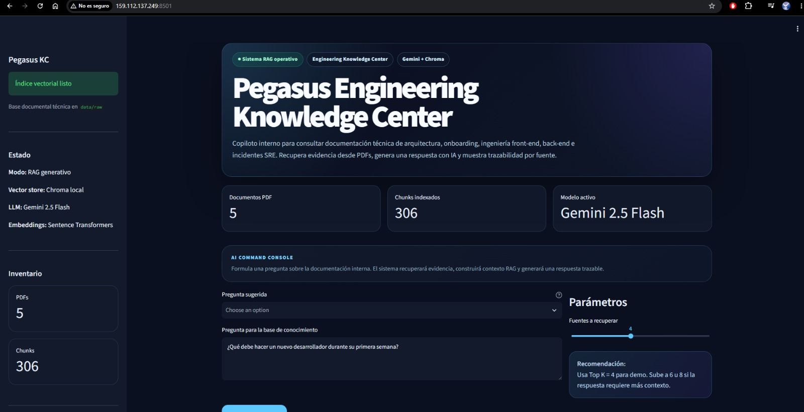
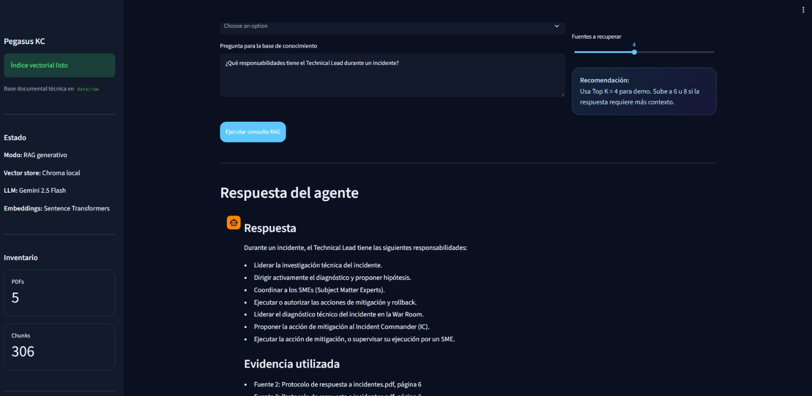
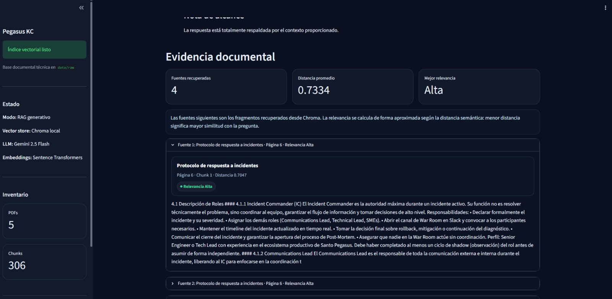
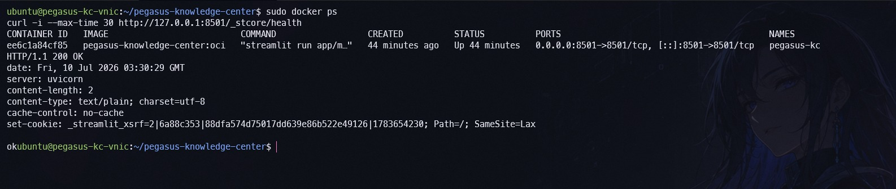
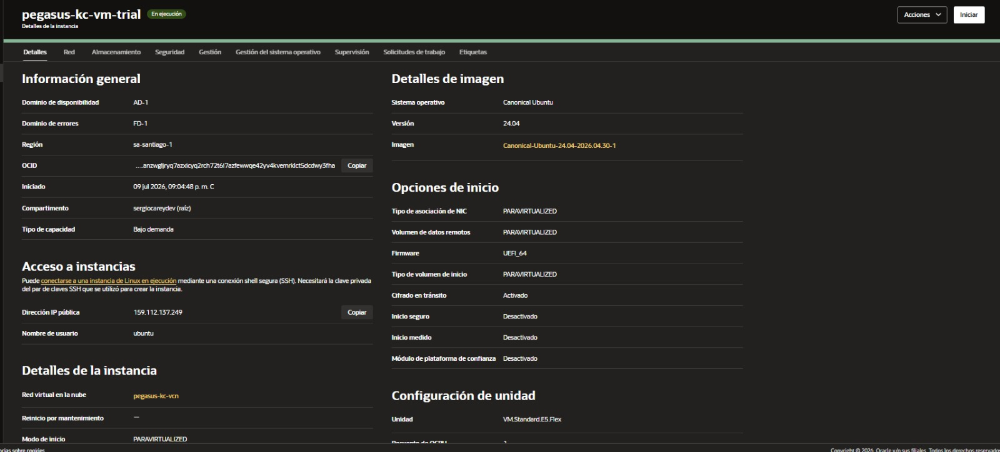

# Pegasus Engineering Knowledge Center

> Agente RAG para consultar documentación técnica con **Python 3.12**, **Streamlit**, **Sentence Transformers**, **ChromaDB**, **Gemini** y **Docker**.

Pegasus Engineering Knowledge Center fue desarrollado como Challenge Final **Alura Agente** y modela un copiloto interno para equipos de ingeniería, SRE y DevOps. El sistema recupera evidencia desde documentación PDF, filtra resultados por relevancia, genera una respuesta con Gemini y conserva trazabilidad hacia documento, página y fragmento.

[](https://github.com/SC-Sergio/pegasus-knowledge-center/actions/workflows/ci.yml)

---

## Estado del proyecto

| Componente | Estado |
|---|---|
| Ingesta de PDF | ✅ |
| Chunking con cortes naturales y overlap | ✅ |
| Embeddings locales normalizados | ✅ |
| ChromaDB persistente con distancia cosine | ✅ |
| Recuperación Top-K | ✅ |
| Relevance gating / abstención | ✅ |
| Gemini con system instruction separada | ✅ |
| Trazabilidad documento / página / chunk | ✅ |
| Interfaz Streamlit | ✅ |
| Docker no-root + healthcheck | ✅ |
| Tests automatizados | ✅ |
| GitHub Actions CI | ✅ |
| Deployment OCI histórico | 🟡 Offline actualmente |

### Deployment

El proyecto fue desplegado y validado en **Oracle Cloud Infrastructure (OCI Compute)** durante su etapa de demostración. La instancia pública usada en esa evaluación se encuentra **offline actualmente**, por lo que el repositorio no presenta esa URL como una demo activa.

La evidencia del despliegue histórico permanece disponible en `docs/screenshots/`, incluyendo la aplicación pública, healthcheck del contenedor y la instancia OCI.

---

## Problema que resuelve

La documentación interna de un equipo técnico suele repartirse entre manuales de onboarding, arquitectura, protocolos de incidentes y guías de ingeniería. Pegasus permite consultar ese corpus en lenguaje natural sin perder la trazabilidad de la respuesta.

Ejemplos:

```text
¿Qué debe hacer un nuevo desarrollador durante su primera semana?
```

```text
¿Qué responsabilidades tiene el Technical Lead durante un incidente?
```

```text
¿Cuáles son los tres pilares filosóficos del front-end?
```

Una respuesta solo llega a Gemini cuando la recuperación semántica encuentra evidencia por debajo del umbral configurado. Si no existe evidencia suficientemente relevante, el sistema **se abstiene** en lugar de forzar una respuesta.

---

## Arquitectura RAG

```text
PDFs
  ↓
pypdf
  ↓
normalización preservando párrafos
  ↓
chunking con cortes naturales + overlap
  ↓
Sentence Transformers
  ↓
embeddings normalizados
  ↓
ChromaDB / HNSW cosine
  ↓
pregunta del usuario
  ↓
Top-K retrieval
  ↓
relevance gate
  ├── sin evidencia → abstención
  └── evidencia suficiente
          ↓
   contexto trazable
          ↓
   Gemini system instruction
          ↓
respuesta + fuentes + alcance
```

### Modelo de embeddings

Por defecto:

```text
sentence-transformers/paraphrase-multilingual-MiniLM-L12-v2
```

Los embeddings se normalizan antes de indexar y consultar. Chroma se configura explícitamente con **cosine distance**.

### Relevance gating

El límite por defecto es:

```text
RAG_MAX_COSINE_DISTANCE=0.65
```

Los vecinos semánticos por encima de ese valor no se envían al LLM. El umbral se puede ajustar mediante variable de entorno y debe calibrarse contra el corpus y preguntas de evaluación.

---

## Corpus documental

El corpus **Santos Pegasus Soluciones** es material educativo de una empresa ficticia usado para el Challenge Final Alura Agente. No contiene documentación confidencial de una empresa real.

Documentos incluidos en `data/raw/`:

```text
Arquitectura de Microservicios y Mapa de Dominios.pdf
Manual de Onboarding para nuevos desarrolladores.pdf
Protocolo de respuesta a incidentes.pdf
Santo pegasus soluciones Guía Oficial de Ingeniería Backend.pdf
Santo pegasus soluciones guia oficial de ingenieria front end.pdf
```

---

## Tecnologías

| Área | Tecnología |
|---|---|
| Lenguaje | Python 3.12 |
| UI | Streamlit |
| PDF | pypdf |
| Embeddings | Sentence Transformers |
| Vector DB | ChromaDB |
| Generación | Gemini |
| Configuración | python-dotenv |
| Testing | pytest |
| Lint | Ruff |
| Dependency audit | pip-audit |
| Contenedores | Docker |
| Cloud histórico | Oracle Cloud Infrastructure |
| CI | GitHub Actions |

---

## Seguridad y controles defensivos

El proyecto incorpora las siguientes medidas:

- `GEMINI_API_KEY` se obtiene desde el entorno; nunca se incluye una clave real en el repositorio.
- `.env`, Streamlit secrets y vector stores locales están excluidos por `.gitignore`.
- El Dockerfile ejecuta la aplicación con un usuario sin privilegios.
- La pregunta tiene longitud máxima configurable.
- Preguntas y documentos recuperados se tratan como **datos no confiables** en la system instruction.
- El LLM solo recibe evidencia que supera el relevance gate.
- La CI ejecuta lint, tests, auditoría de dependencias y build de Docker.
- El deployment público histórico no se presenta como activo mientras la instancia está apagada.

> Para un despliegue público permanente también se recomienda HTTPS, rate limiting, control de acceso y restricciones/cuotas sobre la credencial del proveedor LLM.

---

## Variables de entorno

Copia el ejemplo:

```powershell
copy .env.example .env
```

Configuración:

```env
APP_NAME=Pegasus Engineering Knowledge Center
APP_ENV=dev

DATA_DIR=./data/raw
VECTORSTORE_DIR=./vectorstore/chroma

LLM_MODEL=gemini-2.5-flash
GEMINI_API_KEY=your_api_key_here

EMBEDDING_MODEL=sentence-transformers/paraphrase-multilingual-MiniLM-L12-v2
RAG_TOP_K=4
RAG_MAX_COSINE_DISTANCE=0.65
MAX_QUESTION_CHARS=1200
```

Después del cambio de métrica del vector store, un índice antiguo debe reconstruirse:

```powershell
python scripts\build_index.py
```

---

## Ejecución local

### 1. Clonar

```powershell
git clone https://github.com/SC-Sergio/pegasus-knowledge-center.git
cd pegasus-knowledge-center
```

### 2. Crear entorno virtual

```powershell
python -m venv .venv
.\.venv\Scripts\Activate.ps1
```

### 3. Instalar

```powershell
python -m pip install --upgrade pip
pip install -r requirements.txt
```

### 4. Configurar

```powershell
copy .env.example .env
```

Configura `GEMINI_API_KEY`.

### 5. Construir índice

```powershell
python scripts\build_index.py
```

### 6. Ejecutar

```powershell
streamlit run app\main.py
```

Abrir:

```text
http://localhost:8501
```

---

## Docker

Construcción:

```powershell
docker build -t pegasus-knowledge-center:local .
```

Ejecución:

```powershell
docker run --rm `
  --name pegasus-kc `
  -p 8501:8501 `
  --env-file .env `
  pegasus-knowledge-center:local
```

Health endpoint:

```text
http://localhost:8501/_stcore/health
```

El Dockerfile:

- parte de Python 3.12 slim;
- instala únicamente dependencias directas del proyecto;
- construye el índice vectorial dentro de la imagen;
- ejecuta como usuario no-root;
- expone un `HEALTHCHECK` para Streamlit.

---

## Calidad y CI

Instalar dependencias de desarrollo:

```powershell
pip install -r requirements-dev.txt
```

Ejecutar localmente:

```powershell
ruff check .
pytest
pip-audit -r requirements.txt
```

El workflow `.github/workflows/ci.yml` ejecuta en cada push relevante y Pull Request:

```text
Python 3.12
  ↓
install
  ↓
Ruff
  ↓
pytest
  ↓
pip-audit
  ↓
Docker build
```

Las GitHub Actions de terceros están fijadas por SHA completo.

---

## Estructura

```text
pegasus-knowledge-center/
├── .github/
│   └── workflows/
│       └── ci.yml
├── .streamlit/
│   └── config.toml
├── app/
│   ├── config.py
│   ├── loaders/
│   │   └── pdf_loader.py
│   ├── rag/
│   │   ├── chunking.py
│   │   ├── embeddings.py
│   │   ├── llm.py
│   │   ├── pipeline.py
│   │   └── vector_store.py
│   └── main.py
├── data/
│   └── raw/
├── docs/
│   ├── screenshots/
│   └── test-questions.md
├── scripts/
│   ├── build_index.py
│   └── check_*.py
├── tests/
│   ├── test_chunking.py
│   ├── test_config.py
│   ├── test_pipeline.py
│   └── test_vector_store.py
├── .dockerignore
├── .env.example
├── .gitignore
├── Dockerfile
├── pyproject.toml
├── requirements-dev.txt
├── requirements.txt
└── README.md
```

---

## Evidencia visual

### Aplicación ejecutándose en OCI



### Respuesta RAG y evidencia





### Docker healthcheck



### Instancia OCI durante la demostración



---

## Limitaciones conocidas

- El relevance threshold es una política heurística y debe evaluarse con un set de preguntas representativo.
- El corpus actual es pequeño y educativo.
- No existe autenticación multiusuario.
- El deployment OCI mostrado en las capturas es histórico y actualmente está offline.
- Para producción real se requerirían controles adicionales de red, identidad, observabilidad, rate limiting y secretos gestionados.

---

## Autor

**Sergio Carey**  
Ingeniero en Informática — Chile

Este repositorio demuestra un flujo RAG completo: ingesta documental, embeddings locales, recuperación vectorial, abstención por relevancia, generación con LLM, trazabilidad de fuentes, contenedores y automatización CI.
